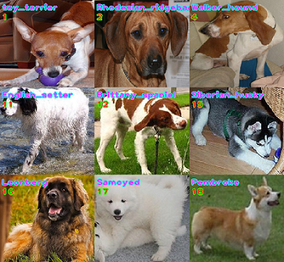

# classification    
物体识别分类   

## 项目介绍    
该项目对物体进行识别分类。  

## 项目配置   
* 作者开发环境：   
* Python 3.7   
* PyTorch >= 1.5.1   

## 数据集     
### 1、Stanford Dogs 数据集  

    

* 采用"Stanford Dogs Dataset"数据集官方地址：http://vision.stanford.edu/aditya86/ImageNetDogs/     
* 本文将该数据集的标注文件更改为xml格式，[数据集下载地址(百度网盘 Password: ks87 )](https://pan.baidu.com/s/1tT0wF4N2I9p5JDfCwtM1CQ)     
* 通过运行read_datasests.py,可以对数据的标注信息进行解析可视化。   
* 该数据集分为 120 类 。  

### 2、静态手势识别数据集（handpose_x_gesture_v1）    

    

* 数据集来源3部分，且网上数据占绝大多数，具体：
* 1）来源于网上数据并自制。
* 2）来源于自己相机采集并自制。
* 3）来源于 kinect_leap_dataset 数据集并自制，其官网地址为：https://lttm.dei.unipd.it/downloads/gesture/  
* 注：数据集如有侵权，请联系删除。
```
kinect_leap_dataset 数据集来源于以下paper项目组的贡献。  
[1] G. Marin, F. Dominio, P. Zanuttigh, "Hand gesture recognition with Leap Motion and Kinect devices", IEEE International Conference on Image Processing (ICIP), Paris, France, 2014  

[2] G. Marin, F. Dominio, P. Zanuttigh, "Hand Gesture Recognition with Jointly Calibrated Leap Motion and Depth Sensor", Multimedia Tools and Applications, 2015  
```

* 数据下载  
  该项目数据集命名为：handpose_x_gesture_v1，[数据集下载地址(百度网盘 Password: 6urr )](https://pan.baidu.com/s/1Sd-Ad88Wzp0qjGH6Ngah0g)
  数据集共 2850 个样本，分为 14 类。  
* 手势定义   

  ：000-one
  ：001-five
  ：002-fist
  ：003-ok   
  ：004-heartSingle
  ：005-yearh
  ：006-three
  ：007-four  
  ：008-six
  ：009-Iloveyou
  ：010-gun
  ：011-thumbUp  
  ：012-nine
  ：013-pink  

* 注意事项   
  如果使用了该项目的14类静态手势数据集请指出引用来源，具体如下所示 ：   
```

[1] G. Marin, F. Dominio, P. Zanuttigh, "Hand gesture recognition with Leap Motion and Kinect devices", IEEE International Conference on Image Processing (ICIP), Paris, France, 2014  

[2] G. Marin, F. Dominio, P. Zanuttigh, "Hand Gesture Recognition with Jointly Calibrated Leap Motion and Depth Sensor", Multimedia Tools and Applications, 2015  

[3] Eric.Lee , https://codechina.csdn.net/EricLee/classification  

```
### 3、imagenet 数据集 （使用“ILSVRC2012_img_train”数据集将原图裁剪后的部分数据集）  
* 因为考虑到本身imagenet数据集很大所以进行了裁剪做了一个mini数据集,如有侵权请联系删除,[数据集下载地址(百度网盘 Password: 6cm9 )](https://pan.baidu.com/s/1C4csbZfj02wM9Y-I5OiPhw)  
* 具体分类看json信息即 [imagenet_msg.json](imagenet/imagenet_msg.json) ，"chinese_name"为类别中文名字，"doc_name"为数据集对应的每一类文件夹名字，前面的数字为模型的类别号从 "0"~"999", 共 1000 类。
* 如果需要完整imagenet数据集，请从官网申请下载，官网地址：http://www.image-net.org/
```
ImageNet is an image database organized according to the WordNet hierarchy (currently only the nouns),     
in which each node of the hierarchy is depicted by hundreds and thousands of images.   
The project has been instrumental in advancing computer vision and deep learning research.   
The data is available for free to researchers for non-commercial use.  
```
### 4、Stanford_Cars 数据集(共196 类)
* [数据集下载地址(百度网盘 Password: txtu )](https://pan.baidu.com/s/1DR9ANGqFS6z90yzU6nlIoA)
* Stanford_Cars官网地址：http://ai.stanford.edu/~jkrause/cars/car_dataset.html

 
* 该数据集出自以下论文：
```
 3D Object Representations for Fine-Grained Categorization
 Jonathan Krause, Michael Stark, Jia Deng, Li Fei-Fei
 4th IEEE Workshop on 3D Representation and Recognition, at ICCV 2013 (3dRR-13). Sydney, Australia. Dec. 8, 2013.

 Note that the dataset, as released, has 196 categories, one less than in the paper, as it has been cleaned up slightly since publication. Numbers should be more or less comparable, though.
```

### 构建自己的数据集  
* 构建一个总的数据集目录，在目录内建立每一个具体类别的子目录，每一个子目录有且只有单独的一个类别。并且文件夹的命名为“数字-名称”，比如上图的“one静态手势”的文件夹命名为“000-one”。  
* 注意名称为英文命名，可以由自己定义，类别编号数字从0开始。  
* 另外在具体训练时，需要在训练脚本 train.py 中进行训练集文件夹路径和类别数的对应修改。  

## 预训练模型    
### 1、Stanford Dogs 预训练模型
* [预训练模型下载地址(百度网盘 Password: ks87 )](https://pan.baidu.com/s/1tT0wF4N2I9p5JDfCwtM1CQ)   

### 2、静态手势识别预训练模型（handpose_x_gesture_v1）    
* [预训练模型下载地址(百度网盘 Password: igcf )](https://pan.baidu.com/s/1WeoYQ3bfTkpbzPbROm81Ew)   

### 3、imagenet 预训练模型
* [预训练模型下载地址(百度网盘 Password: ct31 )](https://pan.baidu.com/s/1uZsAHF6wK-LOR8j6TFABmQ)   
* 具体分类看json信息即"imagenet_msg.json"，运行 [read_imagenet_msg.py](imagenet/read_imagenet_msg.py) 读取。
* "chinese_name"为类别中文名字，"doc_name"为数据集对应的每一类文件夹名字，前面的数字为模型的类别号从 "0"~"999"，共 1000 类 。

### 4、Stanford_Cars 预训练模型
* [预训练模型下载地址(百度网盘 Password: 7bf7 )](https://pan.baidu.com/s/1JY_ia48e92am6JJ_p-kgQg)

## 项目使用方法  
### 模型训练  
   注意: train.py 中的 3个参数与具体分类任务数据集，息息相关，如下所示：
```
    #---------------------------------------------------------------------------------
    parser.add_argument('--train_path', type=str, default = './handpose_x_gesture_v1/',
        help = 'train_path') # 训练集路径
    parser.add_argument('--num_classes', type=int , default = 14,
        help = 'num_classes') #  分类类别个数,gesture 配置为 14 ， Stanford Dogs 配置为 120 ， imagenet 配置为 1000
    parser.add_argument('--have_label_file', type=bool, default = False,
        help = 'have_label_file') # 是否有配套的标注文件解析才能生成分类训练样本，gesture 配置为 False ， Stanford Dogs 配置为 True
```
* 根目录下运行命令： python train.py       (注意脚本内相关参数配置 )   

### 模型推理  
* 根目录下运行命令： python inference.py        (注意脚本内相关参数配置 )   

### 注意事项    
* 因为数据集的整张图会有大量背景、多只狗等干扰因素。本文采用的图像输入是"Stanford Dogs Dataset"数据集的目标边界框范围图像，这样也觉定了在模型推断预测环境下也是以目标物的边界框为范围的图像作为输入。   


## 联系方式 （Contact）  
* E-mails: 305141918@qq.com   
